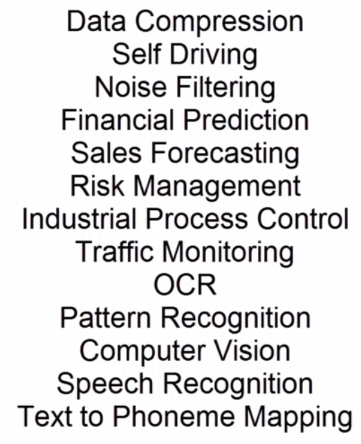

# AI

## Branches in ML
Mainly there are 2 branches in AI. Let's your task is to put potato and tomato in different basket.
### Supervised:
In this, you clearly show difference to the child that this red colour fruit like is tomato and other is potato. It is broadly classified as <b> Classification <b> and <b> Regression <b> 
### Unsupervised:
In this, you only say that categorize everything based on colour.

### Based on input and output relation:
Let's Y = 10X is relation and Y = 10X^n is another relation
1) Linear Relation
X of power 1 is linear
2) Non-Linear Relation
X of power n is non linear

## Classification & Regression: Type of <b> Supervised <b> 

### Types of Regression:

<b>This predict the change in output variable based on  change in input variable <b>

(ii) 
It gives answer only in 0/1 or yes/No

(iii) 
This algorithm divides your data or information into as many decision tree or branches as possible.

(iv) 
This algorithm has a knowledge of certain independent parameters which might affect the outcome. Ex - if you could run a sentiment analysi. so you wouls say if there is a word called bad, then understand that this tweet has <b> negative review <b>. This relationship is non-linear and it's classification.

(v) 

This is like decision tree algo along with some extra layers. This makes multiple decision trees and takes the best start of them to predict the output. 

### Types of unsupervised: 
## Clustering:
 
Grouping the inputs into similar groups.

 (i)
 
 Ex- segmenting cusgtomer based on age, gender, etc.

(ii)
Given set of input, clusters them based on closeness between the data points. It builds an hierarchy on top of that.

(iii) 
given a set of input data, this would group the data bassed on defining a neighbourhood and then density of it to qualify as a cluster. These are 2 parameters. Ex - Given a set of customers, you can detect the customer purchase patterns. so, you can define an age limit. Ex - age limit = 40+/-5, age limit is 35 to 45.

(iv) 

### NLP (Natural Language Processing)
The one of the measure features of human beings are that we can understand, interpret, process language and respond So, 
to make our machine smart our machine should also able to understand various languages.\
 <b> NLP <b> trying to bring this capability to computers.

## Subprocesses of NLP

# Input
This refers to the data we provide to train a machine or model.

# Morphological Processing
Structure of a word is known as Morhology. A word has some syntax like prefix, root, suffix, thirs person, etc. these are known as morphenes. In this process, we try to train model, that how to form a meaningful word.

# Syntactical Processing
It focuses on how words are arranged to form grammatically correct sentences based on syntactic rules.

# Semantic Processing
Through this, we train model to how to form a meaningful sentence, where to place verb, adjective, etc.
# Discourse processing and contextual processing
Bring the context and try to get true meaning of the sentences. Ex - Put the apple which is currently in the basket onto the shelf, have 2 different meaning, only understandable using "discourse"

# Knowledge base

Till this step,this is known as "NLU - Natural language understanding"

 From, Now onward, NLG i.e. Natural Language Generation start

For NLP, we have to use these combination of these:

### Computer Vision
This term refers to the ability of computers to see, Like we humans see, and understans  and process the unstructure stream of information.

For this, there are 3 stages:
# Acquisition 
It means to capture data either in form of photos or videos. Every coloue contains an array of 8 bit integers. So, it helps computer to interpret data.
In this, we do edge detection, segmentation, classification, feature detection. 
# Rendering
generally refers to the process of generating visual content, typically by converting data or models into a visual representation. While the exact meaning can vary depending on the context. In this   
3D Mapping - refers to the generation of 3D images or animations from a model, \  
object recognition - Object recognition is a computer vision task where AI identifies and classifies objects in an image or video. This is typically done using machine learning models, particularly convolutional neural networks (CNNs), which are trained to detect and label various objects. \  
 motion tracking - Motion tracking refers to the process of detecting and following the movement of objects or people across frames in a video. \  
 Auto captioning, Augmented reality, Autonomous Cars, 

 ### Neural networks
 It is like neuron in our brain. It is used for clustering and classify the data. It is also helpful. It is also helpful in extract features which can be fit to other machine learning algorithm under classification and clustering.

 # Perceptron
 It lies under fundamental level of neural network. Its a single algorithm performs binary classification. Basically predicts output is of 1 category or other.
Ex - In this example we will decide, should we take tea or coffee?

<b> Input: <b>   
Let there are 3 inputs

- Weather - cold and rainy = 1 else 0
- Situation - Lots of work = 1 else 0
- Sleep deprivation - 1 else 0

<b> Weights <b>
- 0.3 or 30% to weather
- 0.5 or 50% to work
- 0.2 0r 20% to sleep.

<b> Weighted sum <b>\
 lets say that it is rainy monday after a rather relaxed weekend\
 -> 1*(0.3) + 1*(0.5) + 0*(0.2) = 0.8

<b> Bias <b>\
It is used to force an outcome, influence the acivation function, bringing more flexibility. It can be +ve or -ve.  Here, let  0.4

<b> Activation function <b>\
1, x >=1 and 0, x < 1

<b> Output <b>\
0.8 + 0.4 = 1.2 i.e. 1. So, Drink coffee.

# Single layered Neural networks

 In the above diagram, there are 1 hidden layer with 3 neurons. Each neuron contains All the process from weights to Activation function of perceptron. More number of neurons is helphul because using it we can improve its ability to learn and generalize. Each hidden neuron learns different patterns or features from the input data. It helps our network to capture more complex relationships.

Let we want to train model to identify letter and number. following aare the ways to train model.\
   

# Deep Neural Network or Multi Neural Network
A Deep Neural Network (DNN) is a type of artificial neural network that has multiple hidden layers between the input and output layers.

# Feed forward Neural Network

Here, there is multiple hidden layer andno hidden layer is looping. When input enters, it goes directly from left to right, instead of looping between 1 layer to another.

Here, we have 4X4 pixel i.e. 16 pixcel. so, there is 16 input and since, input is number so, here are 10 outputs. Given, number is more similar like a "1". so, 99%, but it is also similar like "7" so, it is 75%.

Hidden layer also have activation function , which reduce the complexity and output also have.

## How input looks like (in the context of computer vision and machine learning):

Our screen is made up of pixels arranged in a matrix. When we want to represent a number or image, we superimpose that number or image on the pixel grid. The grayscale value is then assigned to each pixel, with scores ranging from 0 to 255 (0 represents complete black, and 255 represents complete white). Using this approach, a matrix is generated that represents the image or number.

# Training Phase
We start training and we get output as 7. Its wrong.
\
We calculate error.
\
Now, trying to adjust weights

## Back propagation
In this, we give input to system and fix the output. After the moving of data from input to output, if output don't match with input then, system backpropagate and try to change values of weight, so that error become 0.

.png>)\
Here, let we get an error of -5. Next time, error reduces to -4 then, -3. Finally, 0.

.png>)
.png>)
.png>)

In all the above example, we have taken step size = 1, but step size plays a very important role, in determining answer.
.png>)
Here, we can see that, on changing step size to 5, we are unable to get 0. And on making it 2, we are able to reduce iterations.

## Applications of feed forward neural networks (FFNN)
Neural networks are universal function approximators. As, it can generalize any complex functions.  

# Convolutional Neural networks
It is primarily used for cluster and classify images. It helps in processing text from images. It helps NLP to understand handwritten documents. Also, understand sound based on rainbow type show. Its most important impact is on Computer Vision.

# How CNN can learn to detect various patterns like textures and shape?
### Convolutional + ReLU
We take an 'input image,' which is a grayscale image with pixel values ranging from 0 to 255, and a 'convolution filter,' which helps us identify patterns. For example, in this case, the filter is a 'T,' and it helps determine whether the image contains the letter 'T' or not.

We place the filter on the (1,1) position of the input image and calculate the output by multiplying the corresponding pixel values. For example, if the pixel value at position (1,1) in the input image is 120, and the corresponding pixel in the filter is also 120, we multiply these values (120 * 120), and so on for each pixel.

Once the multiplication for all the overlapping pixels is completed, we move the filter to the next position, such as (1,2), and repeat the process.

after completing one row, we move the filter to the next row (e.g., from position (1,1) to (2,1)) and repeat the multiplication process. 

 (Dimension - height * weight * depth)  
(The output from the convolution operation will have dimensions: height * width * depth. For grayscale images, the depth is 1 (because there’s only one channel), while for RGB images, the depth is 3 (one for red, one for green, and one for blue).)
### Why output goes through ReLU layer?
- The ReLU (Rectified Linear Unit) activation function is applied to the output of the convolutional layer.

- it basically **replaces negative values with zero** while keeping positive values unchanged.
- It introduces **non-linearity**, which helps the model learn complex patterns.

#### **Why 9 Neurons?**
- The input image has a 5×5 dimension.
- A 3×3 filter is applied.
- The output feature map size is calculated as:
  \[
  \frac{(5 - 3)}{1} + 1 = 3
  \]
  So, the output matrix is 3×3×1.
- Each value in this **3×3 output matrix** corresponds to **one neuron**.
- Since the output matrix has 3×3 = 9 elements, we say there are **9 neurons**.

Thus, the **9 neurons** represent the 9 values in the 3×3 output feature map after applying the convolution operation. These neurons will then pass through the **ReLU activation** to introduce non-linearity.

## Pooling
.png>)

.png>)
Here, we can see greyscale is 5X5X1 and filter is 3X3X1. The output which we get is of dimension is 3X3X1.  We want that output is of same dimension so use *padding layer*
.png>)
Here, we add 2 row and 2 column with values '0'. Now, greyscale is 7X7X1 and filter is 3X3X1. Here, we are getting output of dimension is 5X5X1.
